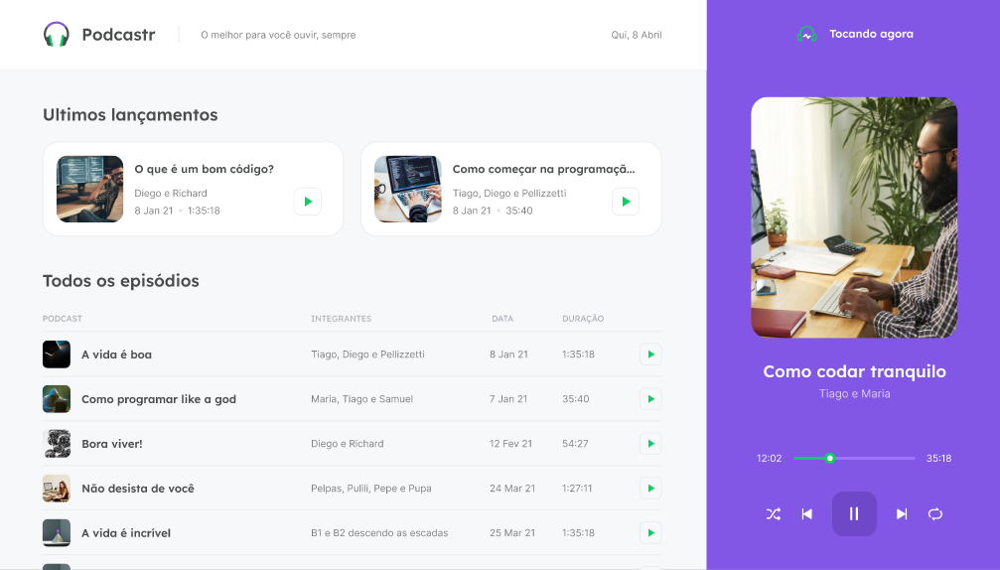

## Podcastr

Podcastr is a platform built for podcast broadcasting developed during the **[NLW#05](https://nextlevelweek.com/)** offered by **[@Rocketseat](https://github.com/Rocketseat)**.



## 🧪 Technologies

This project was developed using the following technologies:

- [TypeScript](https://www.typescriptlang.org/)
- [React](https://reactjs.org)
- [Next.js](https://nextjs.org/)

## 🚀 Getting started

Clone the project and access the folder

```bash
$ git clone https://github.com/GuilhermeVieiraCode/podcastr.git && cd podcastr
```

Follow the steps below
```bash
# Install the dependencies
$ yarn install
# Run the JSON server
$ yarn server
# Start the project
$ yarn dev
```

## 📝 License

This project is licensed under the MIT License. See the [LICENSE](LICENSE.md) file for details.


---

<p align="center">Made with 💜 by Guilherme Vieira</p>


